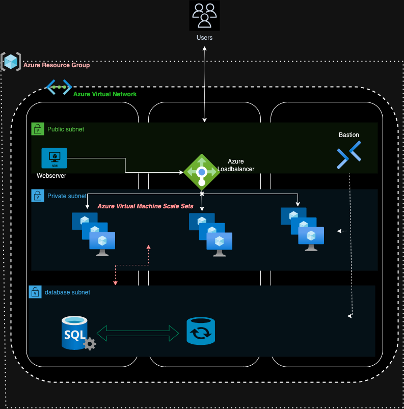

# Azure Infrastructure Setup with Terraform

This repository contains the Terraform configurations and documentation for provisioning infrastructure on Microsoft Azure.

## Table of Contents

1. [Overview](#overview)
2. [Folder Structure](#folder-structure)
3. [Getting Started](#getting-started)
4. [Terraform Modules](#terraform-modules)
5. [Remote State Management](#remote-state-management)
6. [Contributing](#contributing)
7. [License](#license)

## Overview

This Terraform project enables you to provision a secure and scalable infrastructure on Microsoft Azure. It includes configurations for setting up Virtual Networks, virtual machines, sql databases, and more.

## Folder Structure

The repository is organized as follows:

- `0-tfstate`: Contains the main Terraform configuration for managing the remote state using Azure Blob Storage.
- `docs`: Documentation resources, including an infrastructure diagram and setup guides.
- `main.tf`: The main Terraform configuration file for your Azure infrastructure.
- `modules`: Reusable Terraform modules for different components of your infrastructure.
- `provider.tf`: Configuration for the Azure provider.
- `terraform.tfvars`: Variables file containing sensitive information (Please keep this secure and do not commit it to version control).
- `terraform.tfvars.example`: Example variables file for reference.
- `vars.tf`: Variable definitions for your Terraform configuration.

## Getting Started

To reproduce this infrastructure setup, follow the step-by-step instructions in the [Infrastructure Setup Guide](docs/infrastructure-setup.md).

## Terraform Modules

- `app_service`: Terraform module for provisioning VMs for App Service resources.
- `db_service`: Terraform module for managing Azure Database resources.
- `network`: Terraform module for defining Azure Virtual Network resources.
- `security-group`: Terraform module for configuring Azure Security Groups.
- `web_service`: Terraform module for creating web server resources.

## Remote State Management

The `tfstate` folder contains the main configuration for remote state management using Azure Blob Storage. This ensures that your Terraform state is stored securely.

## Contributing

Contributions to this project are welcome! Feel free to open issues or pull requests for any improvements or bug fixes.

## License

This project is licensed under the [MIT License](LICENSE).

Refer to the [Infrastructure Setup Guide](docs/infrastructure-setup.md) for detailed instructions on reproducing the infrastructure setup.

For any questions or assistance, please contact [Your Name](mailto:your.email@example.com).

