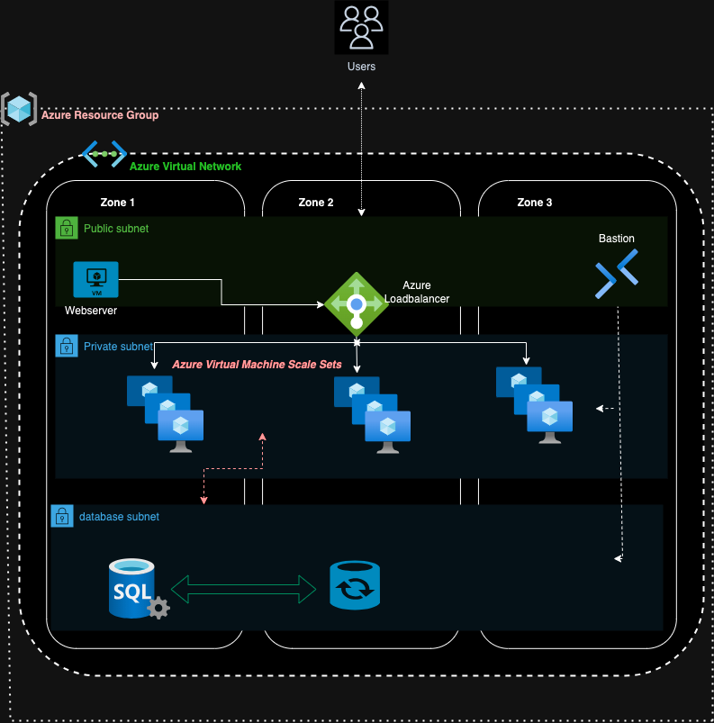

# Azure Infrastructure Setup with Terraform

## High-Level Design

### Objective:
I have successfully created a high-level design for this project, achieving the following objectives:

1. **High-Level Design:** I have structured my infrastructure using Terraform, employing modularization with separate modules for web service, app service, and db service. This approach enhances manageability and scalability.

2. **High Availability:** To ensure high availability, I've distributed my resources across Azure Availability Zones (AZs), reducing the risk of service disruptions.

3. **HTTPS Support:** My web service is secured with HTTPS on port 443, ensuring data integrity and user privacy.

4. **Redirects:** I've manually configured Nginx to redirect HTTP requests on port 80 to HTTPS on port 443, enhancing security and user experience.

5. **Modularization:** I've organized my infrastructure into distinct modules, offering clear resource separation and improved maintainability.

6. **Documentation:** I've provided comprehensive documentation, including a README file, to facilitate understanding and replication of my infrastructure setup.

### Tech Stack:
In terms of technology stack, I've chosen the following components:

1. **Web Service:** I've selected Nginx as the web service, leveraging its lightweight and high-performance characteristics.

2. **Provisioning:** Instead of Ansible, I've opted for Terraform for provisioning Azure resources, harnessing the power of infrastructure-as-code.

3. **Deployment Tool:** For server provisioning, I've utilized Azure-specific tools like `azurerm_virtual_machine_extension`, aligning with Azure best practices.

4. **Operating System:** Ubuntu serves as the operating system for my virtual machines, ensuring compatibility with Nginx and common web application stacks.

### Points to Consider:
As I continue to develop and manage my infrastructure, I'll consider the following key points:

1. **Monitoring and Maintainability:** I plan to implement Azure Monitor or other monitoring solutions to track resource health and performance. Additionally, automated backup and scaling policies will enhance maintainability.

2. **Capacity, Growth, and Security:** With scalability in mind, I'll regularly review and adjust Azure resource configurations to accommodate increased capacity. Azure Security Center and Network Security Groups (NSGs) will bolster security.

3. **Deploying to a Production Environment:** When deploying to a production environment alongside existing VMs, I'll prioritize proper planning and resource tagging. Utilizing Azure Resource Manager (ARM) templates will ensure consistency and version control.

By addressing these considerations and proactively monitoring and optimizing my resources, I aim to ensure the robustness and security of my production environment.

------------------------------------------------------------------------------------------------------------------------------------------
# Infrastructure Setup with Terraform

This repository contains the Terraform configurations and documentation for provisioning infrastructure on Microsoft Azure.

## Table of Contents

1. [Overview](#overview)
2. [Folder Structure](#folder-structure)
3. [Getting Started](#getting-started)
4. [Terraform Modules](#terraform-modules)
5. [Remote State Management](#remote-state-management)
6. [Contributing](#contributing)
7. [License](#license)

## Overview

This Terraform project enables you to provision a secure and scalable infrastructure on Microsoft Azure. It includes configurations for setting up Virtual Networks, virtual machines, sql databases, and more.

## Folder Structure

The repository is organized as follows:

- `0-tfstate`: Contains the main Terraform configuration for managing the remote state using Azure Blob Storage.
- `docs`: Documentation resources, including an infrastructure diagram and setup guides.
- `main.tf`: The main Terraform configuration file for your Azure infrastructure.
- `modules`: Reusable Terraform modules for different components of your infrastructure.
- `provider.tf`: Configuration for the Azure provider.
- `terraform.tfvars`: Variables file containing sensitive information (Please keep this secure and do not commit it to version control).
- `terraform.tfvars.example`: Example variables file for reference.
- `vars.tf`: Variable definitions for your Terraform configuration.

## Getting Started

To reproduce this infrastructure setup, follow the step-by-step instructions in the [Infrastructure Setup Guide](docs/infrastructure-setup.md).

## Terraform Modules

- `app_service`: Terraform module for provisioning VMs for App Service resources.
- `db_service`: Terraform module for managing Azure Database resources.
- `network`: Terraform module for defining Azure Virtual Network resources.
- `security-group`: Terraform module for configuring Azure Security Groups.
- `web_service`: Terraform module for creating web server resources.

## Remote State Management

The `tfstate` folder contains the main configuration for remote state management using Azure Blob Storage. This ensures that your Terraform state is stored securely.

## Contributing

Contributions to this project are welcome! Feel free to open issues or pull requests for any improvements or bug fixes.
---

Refer to the [Infrastructure Setup Guide](docs/infrastructure-setup.md) for detailed instructions on reproducing the infrastructure setup.

For any questions or assistance, please contact [elokac](https://www.linkedin.com/in/eloka-chiejina).

------------------------------------------------------------------------------------------------------------------------------------------

